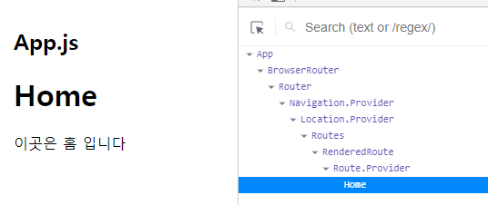
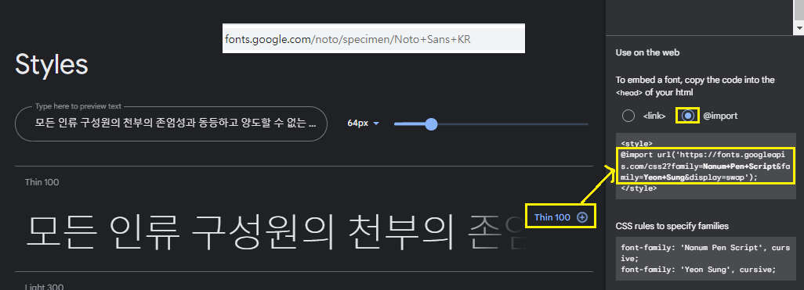
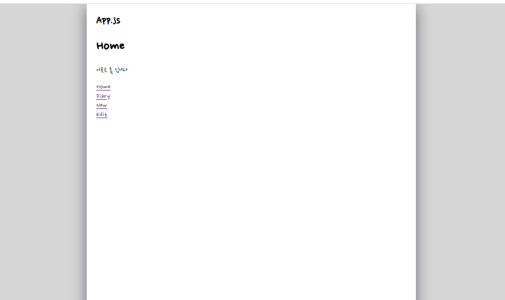

## 1.react router
```
$ npm install react-router-dom@6
```
react router 공식문서 주소 : https://reactrouter.com/

<br />

## 2.Routes
```javascript
import { BrowserRouter, Route, Routes } from 'react-router-dom'
function App() {
  return (
    <BrowserRouter>
      <div className='App'>
        <h2>App.js</h2>
        <Routes>
          <Route path='/' element={<Home />} /> 
        </Routes>
      </div>
    </BrowserRouter>
  );
}

export default App;

```
- Route는 실질적으로 url경로와 컴포넌트를 맵핍시켜주는 컴포넌트이다.


 

위의 코드를 저장하면 다음과 같은 화면이 출력된다.

```javascript
//나머지 경로도 맵핑
<Route path='/' element={<Home />} />
<Route path='/new' element={<New />} />
<Route path='/edit' element={<Edit />} />
<Route path='/diary' element={<Diary />} />
```
<br />

## 3.페이지 이동 (Link)
이전 html에서는 a태그를 이용하여 이동하였지만 그 방식은 MPA(Multiple Page Application)방식 페이지가 이동할 때 마다 새로고침이 발생한다.
- a 태그를 사용하게 되는 경우는 우리 페이지에서 외부로 나갈때 사용

##### Link는 클릭이나 탭을 하여 다른 페이지로 이동할 수 있는 요소이다
a 태그에서 url경로를 명시할 때 href를 사용했다면, Link는 to로 url경로를 명시한다.

```javascript
import { Link } from "react-router-dom";
const RouteTest = () => {
    return <>
        <Link to={'/'}>Home</Link>
        <br />
        <Link to={'/diary'}>Diary</Link>
        <br />
        <Link to={'/new'}>New</Link>
        <br />
        <Link to={'/edit'}>Edit</Link>
    </>
}
export default RouteTest;
```
-> 실제로 페이지가 이동되는것보다는 페이지 역할을 하는 컴포넌트와 url를 바꿔끼는 방식이라고 생각하자.

Link 문서 : https://reactrouter.com/en/main/components/link   
<br />

## 4. React Router Dom의 유용한 기능
#### 4-1. Path Variable
```javascript
//http://localhost:3000/diary/1
<Route path='/diary/:id' element={<Diary />} />
```
다음과 같은 경로를 받기 위해서는 path를 위와 같이 정의해준다.
단, id가 반드시 존재할 경우에는 위의 코드 1줄만 작성하면 되지만 id가 없는 경우가 존재할시 아래와 같이 입력해준다.

```javascript
<Route path='/diary' element={<Diary />} />
<Route path='/diary/:id' element={<Diary />} />
```


이제 ``PathVariable``을 꺼내서 사용하기 위해서는 다이어리 페이지 역할을 하는 Diary컴포넌트에서 처리해준다.
- useParams hook 사용
  ```javascript
    const Diary = () => {
      const {id} = useParams();
      return (
          <div>
              <h1>Diary</h1>
              <p>이곳은 일기 상세페이지 입니다</p>
          </div>
      );
  };
  ```

#### 4-2. Query String
=>웹 페이지에 데이터를 전달하는 가장 간단한 방법(name과 value를 엮어서 전달)

ex) `` /edit?id=10&mode=dark ``

Query String방식을 이용하면 별도의 처리없이 자동으로 맵핑이 된다.

- useSearchParams hook 사용
  ```javascript
  const Edit = () => {
      const [serchParams, setSearcgParams] = useSearchParams();

      const id = serchParams.get('id');
      const mode = serchParams.get('mode');

      return (
          <div>
              <h1>Edit</h1>
              <p>이곳은 일기 수정페이지 입니다</p>
          </div>
      );
  };
  ```

##### 4-3. Page Moving
- useNavigate
```javascript
import { useNavigate, useSearchParams } from "react-router-dom";

const Edit = () => {
    const navigate = useNavigate();
    return (
        <div>
            <h1>Edit</h1>
            <p>이곳은 일기 수정페이지 입니다</p>
            <button onClick={() => { navigate("/home") }}>Home으로 가기</button>
            <button onClick={() => { navigate(-1) }}>뒤로가기</button> 
                {/* -1인자를 넣으면 뒤로가기가 될 수 있다. */>
        </div>
    );
};
export default Edit;
```
링크 태그를 클리 안해도 의도적으로 페이지를 바꿀 수 있다.


사용예시 : 로그인이 안된 사용자가 로그인이 필요한 페이지로 접근하여 강제적으로 로그인 페이지로 이동시킬때
<br />

## 5. 기초 공사 항목
#### 5-1. 폰트 세팅
- Goole Web Fonts를 이용한 프로젝트에 사용되는 폰트 세팅

 
```css
@import url('https://fonts.googleapis.com/css2?family=Nanum+Pen+Script&family=Yeon+Sung&display=swap');

.App {
  padding: 20px;
  font-family: "Nanum Pen Script", cursive;
  font-family: "Yeon Sung", cursive;
}
```
위의 코드를 @import부터 복사하여 css파일에 import 및 사용 

*font-family 는 가장 마지막에 온 속성을 따른다


#### 5-2. 레이아웃 세팅
- 모든 페이지에 반영되는 레이아웃 세팅

```css
@import url('https://fonts.googleapis.com/css2?family=Nanum+Pen+Script&family=Yeon+Sung&display=swap');

body {
  background-color: #d6d6d6;
  display: flex;
  justify-content: center;
  align-items: center;
  font-family: "Nanum Pen Script", cursive;
  min-height: 100vh;
  margin: 0px;
}

@media (min-width :650px) {
  .App {
    width: 640px;
  }
}

@media (max-width :650px) {
  .App {
    width: 90vw;
  }
}

#root {
  background-color: white;
  box-shadow: rgba(61, 56, 75, 0.7) 0px 7px 29px 0px
}

.App {

  min-height: 100vh;
  padding-left: 20px;
  padding-right: 20px;
}
```

 

위의 css코드의 결과물이다.

<details>
<summary>css 필기</summary>

- media 쿼리<br/>
    ㄴ Css에서 어떤 스타일을 선택적으로 적용하고 싶을 때 사용<br/>
    ㄴ @mdia(조건){ 스타일 }
  
- justify-content : 메인축 방향으로 아이템을 정렬하는 속성<br/>
    ㄴ center 시 아이템들이 가운데로 정렬된다.<br/>
    참고 문서 : https://studiomeal.com/archives/197
  
  
- vh  & vw (vertical height & vertical width)<br/>
    ㄴ 뷰포트의 너비값과 높이값에 맞춰 사용가능 <br/>
    ㄴ ex) 브라우저 높이값이 900px일때 1vh => 9px<br/>
         브라우저 너비값이 750px일때 1vw => 7.5px
</details>


#### 5-3. 이미지 에셋 세팅
- 감정 이미지들을 프로젝트에서 불러와 사용할 수 있는 환경 세팅<br/>
  1.  public하위에 이미지 넣기
       <br/>
  2.  ``` javascript
      
      ```
      위의 코드의 ``process.env.PUBLIC_URL``은 public 디렉토리를 가리키는 명령어다.<br/>
#### 5-4. 공동 컴포넌트 세팅
- 모든 페이지에 공통으로 사용되는 버튼, 헤더 컴포넌트 세팅
  1. 공통부분 - 버튼
      1. App.css

      ```css
        /* MyButton */
        .MyButton {
          cursor: pointer;
          border: none;
          border-radius: 5px;

          padding-top: 10px;
          padding-bottom: 10px;
          padding-right: 20px;
          padding-left: 20px;

          font-size: 18px;

          white-space: nowrap;
          font-family: "Nanum Pen Script", cursive;
        }
      ```
      
      <br />
      
      2. App.js

      ```javascript 
          <MyButton text={'버튼'} 
          onClick={() => { alert('버튼 클릭') }} 
          type={'positive'} />
      ```
      <br />
       3. MyButton.js
  
      ```javascript
          const MyButton = ({ text, type, onClick }) => {
              return (
                  <button className={["MyButton", `MyButton_${type}`].join(" ")}
                      onClick={onClick}>{text}</button>
              )
          }

          MyButton.defaultProps = {
              type: "dafault",
          }
          export default MyButton;
      ```
    

